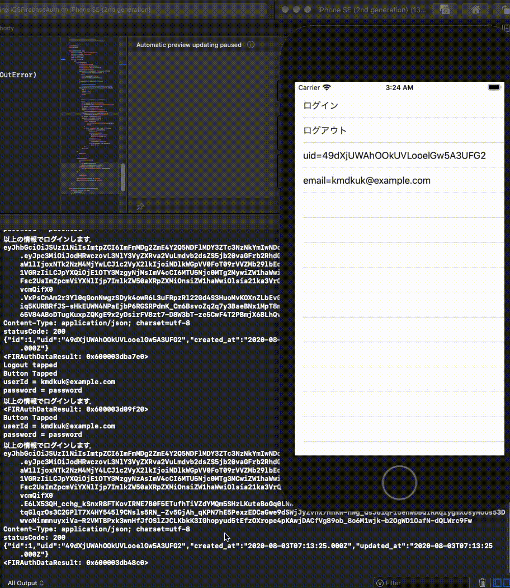

# iOSFirebaseAuth

Railsのfirebase-auth-railsのgemを使ったAPIを立てたときに  
いい感じに認証ができるかを確認するためのサンプルプログラム  

Firebase Authenticationで  
user id: kmdkuk@example.com  
password: password  
のユーザを作って  
GoogleService-Info.plistをダウンロードして適切な位置に配置  
ログインボタンを押すとログインして，uidとemailが表示される．  
裏では， tokenを取得してきて，localhost:3000/usersにpostリクエストを投げつけている．  
rails側で，`FirebaseIdToken::Signature.verify token`がうまく行ったら  
その情報でrailsのDBにユーザデータを登録して，レスポンスが返ってきていることがdebugログに表示されている．  

